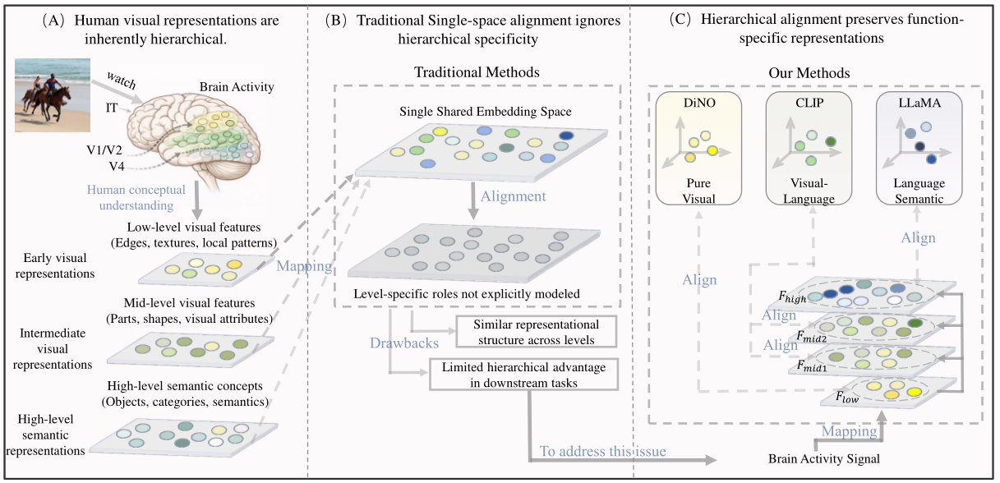

# HTA-NRM

HTA-NRM is a hierarchical framework for visual brain decoding that aligns neural activity with multi-level semantic representations derived from pretrained vision–language models.  
The approach emphasizes hierarchy-aware alignment and topology-informed regularization to enhance robustness, semantic consistency, and cross-subject generalization of learned neural representations.

This repository contains a **research-oriented implementation**.  
Full reproducibility details and ablation-complete configurations will be released in a subsequent version.

---

## Scientific Question

**How can neural representations of visual perception be aligned with rich semantic structures without collapsing heterogeneous abstraction levels into a single flat embedding space?**

Existing visual brain decoding methods typically align fMRI signals to a single semantic space derived from vision or vision–language models.  
Such *flat alignment* ignores the hierarchical organization of visual semantics in the human brain and may lead to reduced interpretability, instability, and limited generalization.

HTA-NRM addresses this challenge by asking:

- Can brain activity be aligned to **multiple semantic abstraction levels simultaneously**?
- Can hierarchical alignment improve **semantic discriminability** and **cross-subject robustness**?
- How can weak **topological priors from brain organization** stabilize multimodal alignment?

---

## Method Overview

<p align="center">
  
</p>

HTA-NRM explicitly maps neural activity into a hierarchy of latent spaces corresponding to different semantic abstraction levels.
Each level is aligned with semantic representations extracted from pretrained vision–language models, while topology-informed regularization provides additional structural constraints.

Key components include:
- **Hierarchical semantic alignment** across multiple abstraction levels
- **Wasserstein-infused contrastive learning** for distribution-aware alignment
- **Topology-guided regularization** to improve representation stability

---

## Repository Structure

```text
HTA-NRM/
├── dataset/
│   └── brain_dataset.py    # Dataset interface for fMRI signals and stimulus annotations
│
├── loss/
│   └── losses.py           # Loss functions for hierarchical brain–semantic alignment
│                           # (WIC loss, Sinkhorn OT, mutual information)
│
├── model/
│   ├── encoder.py          # Hierarchy-aware neural encoder
│   ├── generator.py        # Decoder for voxel-, region-, and feature-level outputs
│   ├── models.py           # Model wrapper integrating encoder, generator, and mapper
│   └── read.me             # Module-level documentation (implementation notes)
│
├── train/
│   └── train.py            # Alignment-focused training script (research version)
│
└── README.md               # Project overview and scientific motivation
